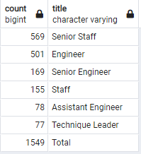

# Pewlett-Hackard-Analysis

### Background
This analysis provides an overview on which employees in Pewlett Hackard are considered mentorship ready as well as how many employees are near retirement, sorted by titles. This information will give a solid overview and aid Pewlett Hackard prepare for the "silver tsunami".

### Results
##### Retirement Ready Employees by Title
- There will be over 72,000 retirement eligible staff in the next upcoming years.
- Over 50,000 of the 72,000 positions are senior positions.
- The table provides data on how long each employee has worked at the company.
##### Mentorship Eligible Employees
- There are currently 1,549 employees that are eligible for the mentorship program.

### Summary:

##### 1. How many roles will need to be filled as the "silver tsunami" begins to make an impact?
As the analysis is counted for employees from different ages, we can look at the imminent impact caused by the oldest staff. If we filter the data by the oldest retiring staff at the birth year of 1952, we can get an idea of how many staff are set to retire imminently.

##### Retirement Ready Staff Born 1952

As we can see by the table above, a total of 16981 positions need to be filled as the "silver tsunami" begins to make an impact".

##### 2. Are there enough qualified, retirement-ready employees in the departments to mentor the next generation of Pewlett Hackard employees?
Based on the ~72,000 staff retiring in the next few years, only 1,549 staff are eligible to mentor. If we go by the assumption that all of these employees are accepting the mentorship job offer, and that the ~72,000 staff retire within a 3 year timeframe as per the analysis, and each mentor is assigned to mentor new staff for 1 year per new hire, the mentors would need to mentor **~16** new hirers per year, for 3 years, to make up for the ~72,000 new positions. Depending on the position and department needs, this number can be quite high, and may not give the new hires enough time to be mentored by the retirement-ready employees.

